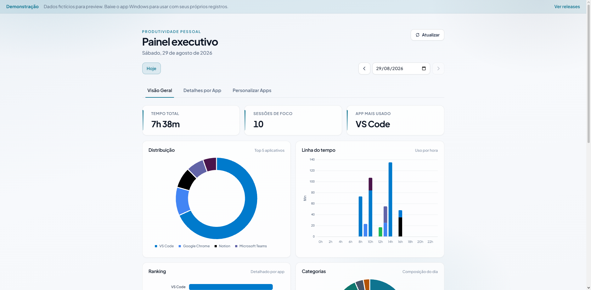

# TimeTracker - Monitor de Produtividade Pessoal

O **TimeTracker** é uma aplicação para Windows que monitoriza automaticamente a janela ativa do computador, registando quanto tempo é gasto em cada aplicação e site. O projeto inclui um dashboard interativo para análise de dados e gestão de categorias.

**Demo online (dados fictícios):** [https://guilhermeroesler.github.io/TimeTracker/](https://guilhermeroesler.github.io/TimeTracker/)



## 🚀 Funcionalidades

- **Rastreio Automático**: Monitoriza a janela ativa em segundo plano e regista o tempo de uso na base de dados SQLite local.
- **Dashboard Interativo**: Interface web com Chart.js que oferece:
  - Métricas de tempo total e foco.
  - Gráficos de distribuição (donut) e linha do tempo (barras empilhadas).
  - Ranking detalhado de aplicações mais usadas.
  - Análise específica por abas (ex: detalhar tempo gasto em abas do Opera/Chrome).
- **Personalização**: Permite renomear aplicações, atribuir cores e definir categorias (ex: Trabalho, Estudo, Lazer).
- **System Tray**: A aplicação corre minimizada na bandeja. "Abrir Dashboard" abre uma **janela nativa WebView2**. O menu também permite **verificar atualizações** (GitHub Releases).
- **Inicialização Automática**: Cria um atalho na pasta de startup do Windows para iniciar com o sistema.

## 🛠️ Requisitos

- **Sistema Operativo**: Windows 10 ou superior.
- **Desenvolvimento**: [.NET SDK 8](https://dotnet.microsoft.com/download).
- **Uso (instalador)**: o Setup baixa automaticamente o .NET 8 Desktop Runtime e o ASP.NET Core Runtime se faltarem.
- **WebView2**: incluído na maioria dos Windows 10/11 modernos.

## 📦 Instalação

### Instalador (recomendado)

1. Descarregue `TimeTrackerPro-*-setup-win-x64.exe` da [release](https://github.com/).
2. Execute o Setup (instala em `Program Files` e cria atalhos).
3. Inicie pelo menu Iniciar ou pela área de trabalho.

Dados ficam em `%LocalAppData%\TimeTracker Pro\data\` (não em Program Files).

### Desenvolvimento (código-fonte)

1. Instale o [.NET SDK 8](https://dotnet.microsoft.com/download).
2. Duplo clique em **`run.bat`** — inicia tracker + dashboard em `http://localhost:8501`.
3. Use o ícone na bandeja do sistema para abrir o dashboard ou encerrar.

Após alterar HTML/CSS/JS do dashboard, rode **`build.bat`** (rebuild Debug com cópia fresca do `wwwroot`) e reinicie pelo `run.bat`. O build incremental do `dotnet run` às vezes não atualiza esses arquivos.

```bash
build.bat                              # rebuild Debug + wwwroot fresco
dotnet build TimeTracker.sln               # build normal (incremental)
dotnet run --project src/TimeTracker.Tracker   # equivalente ao run.bat
dotnet run --project src/TimeTracker.Dashboard # API + wwwroot isolados (dev)
dotnet test TimeTracker.sln                   # testes automatizados
```

### Publish local

```powershell
.\scripts\Publish-Release.ps1 -Version "1.0.0"
# requer Inno Setup 6 para gerar o Setup.exe
```

### Portable (avançado)

Zip `*-portable-win-x64.zip` — exige .NET 8 Desktop + ASP.NET Core Runtime já instalados.

## ▶️ Como Usar

Duplo clique em **`run.bat`** na pasta do projeto (ou `TimeTracker.exe` na release).

Isto irá:

1. Iniciar o monitoramento de janelas ativas em segundo plano.
2. Lançar o servidor do dashboard (ASP.NET Core).
3. Adicionar um ícone à bandeja do sistema (perto do relógio).
4. Registar um atalho na pasta de startup do Windows (se ainda não existir).
5. O dashboard fica disponível em `http://localhost:8501` (abra pelo ícone na bandeja do sistema).

### Funcionalidades do Dashboard

- **Visão Geral**: Veja onde gastou o seu tempo no dia selecionado.
- **Filtros**: Selecione datas anteriores na barra lateral.
- **Detalhes por App**: Selecione um navegador para ver em quais sites passou mais tempo.
- **Personalizar Apps**: Na aba dedicada, mude nomes de exibição, cores e categorias.

## 📂 Estrutura do Projeto

```
TimeTracker/
├── TimeTracker.sln
├── run.bat                      # entry point (duplo clique)
├── build.bat                # rebuild Debug + wwwroot fresco
├── src/
│   ├── TimeTracker.Core/        # SQLite, settings JSON, TrackingEngine
│   ├── TimeTracker.Tracker/     # Win32, bandeja, Kestrel in-process, WebView2
│   └── TimeTracker.Dashboard/   # API + wwwroot (embutido no Tracker)
│       └── wwwroot/demo/        # dataset mock para GitHub Pages / ?demo=1
├── app_settings.example.json
├── productivity.db              # gerado em runtime (não versionado)
└── app_settings.json            # personalizações (não versionado)
```

### Demo no GitHub Pages

O workflow `.github/workflows/pages-demo.yml` publica o `wwwroot` estático com dados mockados. Em Settings → Pages, use fonte **GitHub Actions**. Localmente: `http://localhost:8501/?demo=1`.

## 📝 Notas

- A base de dados utiliza o modo WAL (Write-Ahead Logging) para melhor performance e concorrência.
- Use a opção **"Sair"** no ícone da bandeja para encerrar completamente (tracker + dashboard).
- Documentação técnica: [`.cursor/skills/timetracker-spec/`](.cursor/skills/timetracker-spec/).
