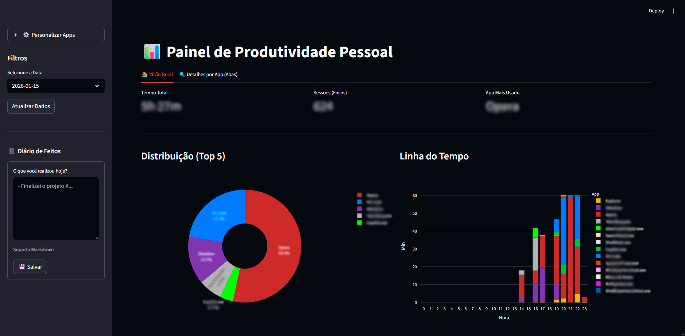

# TimeTracker - Monitor de Produtividade Pessoal

O **TimeTracker** é uma aplicação para Windows que monitoriza automaticamente a janela ativa do computador, registando quanto tempo é gasto em cada aplicação e site. O projeto inclui um dashboard interativo para análise de dados e gestão de categorias.

> **Migração de stack em andamento:** Python/Streamlit → C#/ASP.NET Core + Chart.js.  
> Documento de fases, progresso e decisões: [`.cursor/skills/timetracker-spec/MIGRATION.md`](.cursor/skills/timetracker-spec/MIGRATION.md)



## 🚀 Funcionalidades

- **Rastreio Automático**: Monitoriza a janela ativa em segundo plano e regista o tempo de uso na base de dados SQLite local.
- **Dashboard Interativo**: Interface web construída com Streamlit que oferece:
  - Métricas de tempo total e foco.
  - Gráficos de distribuição (Pizza) e linha do tempo (Barras) usando Plotly.
  - Ranking detalhado de aplicações mais usadas.
  - Análise específica por abas (ex: detalhar tempo gasto em abas do Opera/Chrome).
- **Personalização**: Permite renomear aplicações, atribuir cores e definir categorias (ex: Trabalho, Estudo, Lazer).
- **System Tray**: A aplicação corre minimizada na bandeja do sistema, permitindo abrir o dashboard ou encerrar o processo facilmente.
- **Inicialização Automática**: Cria um atalho na pasta de startup do Windows para iniciar com o sistema.

## 🛠️ Requisitos

- **Sistema Operativo**: Windows.
- **Python** (stack legada): 3.8+ — ver `requirements.txt`.
- **.NET SDK** (stack nova): 8.0+ — [download](https://dotnet.microsoft.com/download).

## 📦 Instalação

### Stack C# (migração — Fase 1)

1. Instale o [.NET SDK 8](https://dotnet.microsoft.com/download).
2. Na raiz do repositório:

```bash
dotnet build TimeTracker.sln
```

3. Execute o tracker nativo: duplo clique em `run-tracker.bat` (ícone na bandeja).
4. Para o dashboard Streamlit (ainda completo), use `run.bat` ou inicie o Streamlit manualmente — ver secção abaixo.

> Durante a migração, **não execute dois trackers em simultâneo** (`run-tracker.bat` e `python main.py`). Ambos gravam no mesmo `productivity.db`.

### Stack Python (legada — ainda funcional)

1. Clone o repositório ou descarregue os ficheiros.
2. Instale as dependências listadas no `requirements.txt`:

```bash
pip install -r requirements.txt
```

3. (Opcional) Copie `app_settings.example.json` para `app_settings.json` para começar com configurações de exemplo. O ficheiro é criado automaticamente na primeira personalização de apps.

> **Nota**: As principais bibliotecas incluem `streamlit`, `pandas`, `pywin32`, `plotly`, `pystray` e `Pillow`.

## ▶️ Como Usar

Para iniciar a aplicação, dê **duplo clique** em `run.bat` na pasta do projeto.

O script cria o ambiente virtual (`venv/`), instala as dependências e inicia o app. Na primeira execução pode demorar um pouco mais.

Alternativa manual:

```bash
python main.py
```

Isto irá:

1. Iniciar o processo de rastreio (`tracker.py`) em segundo plano.
2. Lançar o servidor Streamlit (`dashboard/app.py`).
3. Adicionar um ícone à bandeja do sistema (perto do relógio).
4. Registar um atalho na pasta de startup do Windows (se ainda não existir).
5. O dashboard fica disponível em `http://localhost:8501` (abra pelo ícone na bandeja do sistema).

### Funcionalidades do Dashboard

- **Visão Geral**: Veja onde gastou o seu tempo no dia selecionado.
- **Filtros**: Selecione datas anteriores na barra lateral.
- **Detalhes por App**: Selecione um navegador para ver em quais sites passou mais tempo.
- **Personalizar Apps**: Na aba dedicada, mude nomes de exibição, cores e categorias.

## 📂 Estrutura do Projeto

### .NET (`src/`)

- `TimeTracker.sln`: Solution com os três projetos abaixo.
- `src/TimeTracker.Core/`: SQLite, settings JSON, motor de polling (`TrackingEngine`).
- `src/TimeTracker.Tracker/`: Captura Win32, bandeja do sistema, atalho de startup.
- `src/TimeTracker.Dashboard/`: ASP.NET Core + `wwwroot/` (esqueleto Chart.js).
- `run-tracker.bat`: Inicia o tracker C# (duplo clique).
- `run-dashboard.bat`: Inicia o dashboard web .NET (dev).

### Python (legado)

- `run.bat`: Atalho Windows — cria `venv`, instala dependências e inicia o app (duplo clique).
- `main.py`: Orquestrador principal. Inicia o tracker, o dashboard e o ícone da bandeja.
- `tracker.py`: Captura a janela ativa, grava atividades no SQLite e gere `app_settings.json`.
- `app_paths.py`: Caminhos da aplicação (código-fonte ou executável PyInstaller).
- `dashboard/`: Pacote do dashboard Streamlit.
  - `app.py`: Ponto de entrada do dashboard.
  - `data.py`: Carregamento e pré-processamento dos dados.
  - `filters.py`: Filtros da barra lateral.
  - `overview.py`: Aba de visão geral.
  - `details.py`: Aba de detalhes por app.
  - `charts.py`: Gráficos Plotly reutilizáveis.
  - `utils.py`: Funções auxiliares de formatação e cores.
  - `settings.py`: Aba de personalização de apps.
- `app_settings.example.json`: Exemplo de configurações de apps.
- `app_settings.json`: Configurações personalizadas dos apps (nome, cor, categoria) — local, não versionado.
- `productivity.db`: Base de dados SQLite com registos de atividade (gerada automaticamente na primeira execução).

## 📝 Notas

- **Migração:** consulte [MIGRATION.md](.cursor/skills/timetracker-spec/MIGRATION.md) para fases, progresso e regras de convivência entre stacks.
- Durante a Fase 1, use `run-tracker.bat` (C#) **ou** `run.bat` (Python) — nunca os dois trackers em simultâneo.
- Ao fechar a aplicação pelo "X" do terminal, o processo pode continuar a correr na bandeja. Use a opção "Sair" no ícone da bandeja para encerrar completamente.
- A base de dados utiliza o modo WAL (Write-Ahead Logging) para melhor performance e concorrência.
